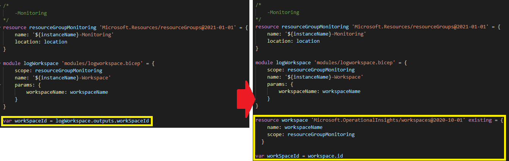

# GitOps - Infrastructure as Code using Bicep

The infrastructure required to run Ultimo on Azure was created with powershell. This worked very well for the initial setup, but changes to the platform are often done manually. Because of this, it is harder to have a proper process that allows reviewing and gatekeeping any changes to the platform. The GitOps principle is that the entire system is described declaratively, just like other source code. To improve on this, we wanted a definition that describes the infrastructure and an automated process to apply the changes. We looked into various technologies like 'Pulumi', 'Terraform', 'ARM' and 'Bicep'.

In this article we will be using Bicep to describe an existing infrastructure.

# Setup Bicep development environment

If you are familiar with Azure CLI, setting up your Bicep development environment is easy. Install Bicep through Azure CLI.
```
> az bicep install
> az bicep upgrade
```

You need to manually add the Bicep install directory to your PATH. It is installed in 'C:\\Users\\[user]\\.azure\\bin'.

I recommend using VS Code for editing Bicep files. Optionally install the Bicep VS Code extensions. This extension is pretty good, it has syntax highlighting, shows basic errors and has intellisense.

# Export ARM template and convert

All resources on Azure are internally described in ARM templates. ARM is the internal infrastructure definition used to describe the desired state. Any modification made using either the Azure portal or using script will result in a modification to these ARM templates. If you use the Azure Resource Explorer, you can view the current state (https://resources.azure.com/).  


It is possible to export any existing resource from Azure to an ARM template.
```
> az group export --name "[ResourceGroupName]" > [ResourceGroupName].json
```

In my case, I ended up with a directory containing templates for all resources groups.  


An ARM template can then be converted into a Bicep template. It will take the input file and generate a file with a .bicep extension.
```
> az bicep decompile --file [ResourceGroupName].json
```

# Modify generated Bicep template

The decompiled Bicep file is not ready to be used yet. It is a good starting point, but it will contain a lot of noise that is not needed. It also generates variables that you'll probably want to change or at least rename.  


My approach was to start by converting the Bicep files into generic modules that can be reused. Then make a main.bicep with a parameter file so it can be used to deploy multiple instances.  


The scope of main.bicep is 'subscription', this allows deploying multiple resource groups. The resource groups are created in main.bicep and used as scope for the modules.  


I am not going to describe all the details on how to create clean Bicep files. A very good starting point is the Microsoft learning path 'Deploy and manage resources in Azure by using Bicep' (https://docs.microsoft.com/en-us/learn/paths/bicep-deploy/).

# Dry run Bicep to predict changes

There is a built-in function to predict the changes that will be made if you deploy the template. To do this, use the what-if option.
```
> az deployment sub what-if --location $location --template-file $bicepFile --parameters $parameterFile
```

The output is shown like this:  


This would have been very cool, if the output was reliable. Unfortunately, this is a best effort prediction. Many change predictions are accurate, but some are ignored and some are invalid. I did notice that when you are working with modules, what-if ignores modules that use output from other modules ([GitHub issue](https://github.com/Azure/arm-template-whatif/issues/157)). This issue is not specific to Bicep, it is an issue in ARM. I worked around this by removing the outputs from modules and then get the resource again in the main script using the existing keyword. In the image below these changes are highlighted.  


Another thing that you should be aware of, is that resources that are removed from the Bicep template are not always deleted from Azure. These resources are then shown as ignored in the output of what-if. For me, this is not really a bad thing. It is a little unpredictable at times. For example; databases in SqlServer are ignored when missing in the template, but databases in a failover group will be removed.  


Another thing I discovered is that what-if sometimes throw errors with a very poor message. For example; if you create a privateDnsZoneGroups with a very long name, it will throw a DeploymentWhatIfResourceInvalidResponse message without any details. It took forever to find out what caused it, especially since the deploy ignored the resource without any error. Hopefully this will be improved upon in the future. Until then, I will make sure to run what-if often to detect issues early on.

# Visualise template

I am using Visual Studio Code with the Bicep extensions. The most important features are the syntax highlighting and intellisense. One nice to have I want to show is the built-in visualiser. There is a small button on the top left corner, highlighted in the image below, that toggles the visualisation of the template. It is not perfect, but depending on how you structured your modules it can be helpful. Dependencies within a module are pretty accurate. Since I do not use output properties to define dependencies between modules, these are missing. It will visualise dependencies that are defined using dependsOn.  


# Deploy Bicep to azure

If you are confident enough, now it is time to deploy. Since I created multiple resource groups, the deployment is done on the subscription level. The result is a consistent configuration. No missing firewall settings and the naming is consistent.
```
> az deployment sub create --location $location --template-file $bicepFile --parameters $parameterFile
```

# Comparison to Terraform and Pulumi

Bicep is has it's problems. But what about the direct competition? How does Bicep compare to Terraform and Pulumi? In the table below I made a high level comparison.

|                     | ARM         | Bicep       | Terraform   | Pulumi
| ------------------- | ------------|-------------|-------------|------------
| Language            | json/yaml   | DSL         | HCL         | C#
| State               | Azure       | Azure       | State file  | State file
| Owner               | Microsoft   | Microsoft   | Terraform   | Pulumi
| License             | Free to use | Free to use | Free to use | Paid

Bicep/ARM are managed by Microsoft. You will get day-0 support for Azure services, whereas for Terraform and Pulumi you are dependent on a third party. Pulumi uses C# as language, personally I prefer this over the others. Both Terraform and Pulumi claim to support multi-cloud. This is true, but you need to write specific code per cloud provider. The most important comparison for us is how the state is handled. ARM/Bicep compares directly against Azure, while the others use a state file. I do think that Terraform and Pulumi have more maturity than Bicep.

Is Bicep better than the competition? Maybe. If it matures, probably.

# References

Microsoft learning path 'Deploy and manage resources in Azure by using Bicep':  
https://docs.microsoft.com/en-us/learn/paths/bicep-deploy/

Find Bicep templates examples for all resource types:  
https://docs.microsoft.com/en-us/azure/templates/microsoft.network/dnszones/a?tabs=bicep

Browse Azure resource definitions:  
https://resources.azure.com/