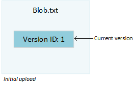
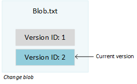
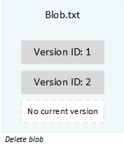
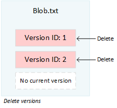
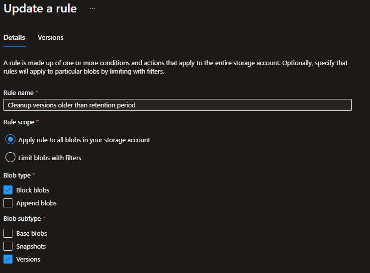
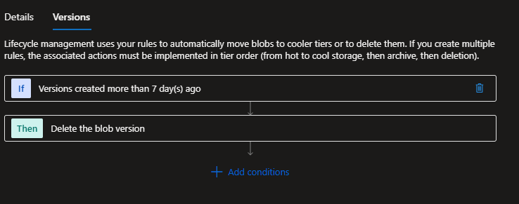

# Azure Blob Storage - Performance Issues

Recently one of our partners reported that the File Explorer tool in Ultimo was unusable. This tool is essential for them, making this a critical issue.

After a short investigation we noticed that listing files was not only extremely slow in the application, but also when attempting to access it in the Azure Portal. It took an amazing 28 minutes to load the directory structure in the Azure Portal Storage Browser. We are using Azure Blob Storage to store our files and usually this is very performant. A file is stored as a blob (Binary Large Object), each blob represents one file.

## Soft Delete

We have enabled 'Soft Delete' and 'Versioning', as a service to protect the files. After investigation we noticed that deleted blobs are not really deleted, but made invisible. This was to be expected, since we have configured a 7 day retention period. We expect files to be recoverable within this period. What we did not expect, is that deleted files have a negative impact on performance. This specific environment has millions of files that are not fully deleted. This explains why loading the File Explorer in Ultimo or the Storage Browser in Azure is extremely slow.

## Versions

Now we know what the cause of the issue is, we can search for a solution. First we tried to find an easy way to permanently delete the dangling files, to clean up. This is not possible in an easy or safe way. Then we noticed that we made a mistake in our code to delete blobs! This issue is not easily spotted. To explain what happens, you have to understand the underlying structure.

When you create a new blob, it will result in a blob with a version. The blob represents the name and points to a specific version of the data.

When data is modified, this will result in a new version and the blob will then point to that new version of the data.

When a blob is deleted, it will no longer point to any version of the data. It will become 'unversioned', stale, invisible or whatever state it is in. In the Storage Explorer it is hidden, but the versions are still there. And that is what happened. We deleted blobs and we assumed that they were then deleted and recoverable for the given retention period.

What we should have done, is go through all versions and delete each version. The version represents the data and after deletion it will be recoverable until the retention period is over.

We never deleted any version, causing all blobs to still exist! The blobs were invisible, but using storage and causing performance degradation. Even blobs that had been 'deleted' over a year ago, still existed. Knowing that the application often creates temporary files, you can imagine that many garbage files were dangling in our blob storage. For this specific customer we found millions of dangling temporary files.

## Cleaning Up

This issue potentionally has a negative performance impact for many customers. It might not always be noticable, but in some occasions it could generate heavy load on our systems. We have started to clean up files that should have been deleted. We have written an automated process for this. A huge operation, we have to verify tens of millions of blobs. This has to be done for all environments, including production, test, demo and development. For our StagingTenant environment (our canary for releasing updates) it took about 3 hours to clean up. The environment this was discovered in, has already been running for over 20 hours. It might take weeks to clean up everything.

## Lifecycle Management

We also need to fix the application, to ensure that from now on files will be really deleted. Azure has the posibility to create Lifecycle Management Policies that can help with this. We created a rule to cleanup versions. It works almost as expected, the rule deletes previous versions after a specified period. Then the deleted versions are still recoverable for the configured retention period. The current version will be untouched.

According to the documentation, it can take up to 24 hours before the new rule is enabled. Then it can take another 24 hours before it is executed for the first time. We will keep 'Soft Delete' and 'Versioning' enabled, as a service to protect files.

Read more about Lifecycle Management in the [Microsoft documentation](https://docs.microsoft.com/en-us/azure/storage/blobs/lifecycle-management-overview).

## Conclusion

We are very happy to have found this issue. When we enabled 'Soft Delete' we never expected this side effect. It is a strange design choice, to make it very easy to enable versioning but then have to write rules to make the retention work. We overlooked the impact and now have to clean up. This example shows that operating a huge plaform as ours requires constant attention. We continue learning (from our mistakes) and improving our platform.