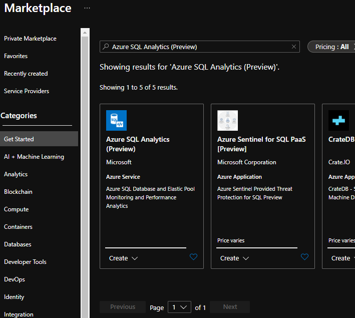
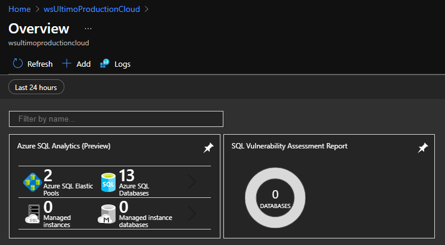

# Performance Azure SQL Elastic Pool - MaxDop

For the Ultimo application we use single tenant databases for our customers. So we have one database per environment, currently resulting in over 400 databases on a singe Azure SQL Elastic Pool. When the number of databases increaded, we noticed random performance degration. We investigated the issue and where able to resolve most of it.

# Enable SQL Analytics

One of the first things we wanted to achieve, is getting a better undestanding what caused the random performance issues. During tests the application usually performed excellent, but some customers experienced timeouts or degraded performance. Looking at the default metrics, the CPU and IO usage on the elastic pool is very low. Is was very clear that with these metrics alone, we couldn't get enough insights to find the cause.


To get more information, we decided to enable Azure SQL Analytics. To enable this, go to the marketplace on Azure and search for SQL Analytics.



Next thing you need to do is enable diagnostics on the database you want to monitor. Note that you need to do this per database and not on the elastic pool itself.


I checked all options and selected the log analytics where I created the SQL Analytics on before.


You can now find SQL Analytics on the Log Analytics Workspace. Go to Workspace Summary and click Azure SQL Analytics (Preview).



The dasboard will start showing data after a few hours. You can drill down and drill down to waits, locks and timeouts.


# Resolving Waits

In SQL Analytics we noticed that most waits where caused by parallelism. By default SQL Server has a max degree of parallelism set to the number of available cores, in our case 32. This can be changed by setting the MAXDOP setting top a different value. In several publications we found it is recommended to lower this value:
https://techcommunity.microsoft.com/t5/azure-sql/changing-default-maxdop-in-azure-sql-database-and-azure-sql/ba-p/1538528#:~:text=Executive%20Summary,0%20(unlimited)%20to%208

The queries we use in our application have little to no benefit from using parellelism. We tried setting MAXDOP to 1 for all databases with the following query:
```
ALTER DATABASE SCOPED CONFIGURATION SET MAXDOP = 1
```

The result was that the waits and timeouts are now resolved. The red marker is before changing MAXDOP, the green marker after.

