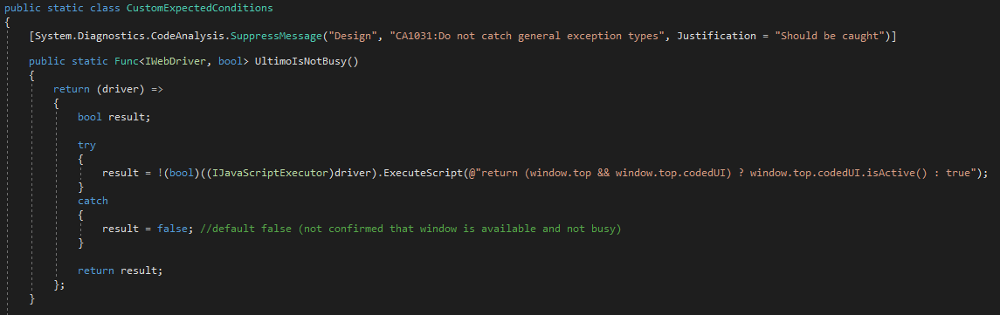

# Stable Selenium Tests

At Ultimo we strive to test the application automatically as much as possible. This is needed because it is not feasible to do it all manually. Most of the code is tested using unit tests that either test the backend or the client code. These tests are reliable and reasonably fast.
The challenge was to also test the interaction between the client and the server. We decided to use Selenium to write integration tests that run on the user interface.

# Selenium Tests

Writing unit tests that use the user interface to interact with the application can be very challenging. A test has to behave like a human would. This includes waiting for pages to load or animations to complete. Another challenge is to write these tests in such a way that it runs reliable and keeps working after UI changes.

Selenium offers an API to interact with the browser. The problem is that if you start using Selenium directly, the tests become very complex very quickly. Also, as your test set is growing, it probably starts becoming more unstable. Another downside is that writing tests using selenium requires a lot of technical knowledge. At Ultimo we wanted to enable testers to write tests as well.

# Test Structure

We decided to start by designing the test code itself. The goal was to make it very straight forward. We ignored all code that is required to synchronise the browser state. An example of how we currently write tests is shown below.  

The tests are written in c#, but in such a way that our test crew can create their own.

# Selenium Page Object Model

The test structure we use is not something we invented. We used the 'Page Object Model' with a fluent interface as a reference design. The low-level logic is hidden in the page classes. In these classes we switch to the correct context, use CSS selectors and have the proper waits.  

This structure helps with keeping the tests readable, but also helps when we need to fix any low-level logic.

# Test Stability

The 'Page Object Model' is a very good design principle for creating a well structured test framework. However, you might need more tricks to get everything reliable. One thing that is very important is to ensure you do not need any sleeps in the code. Sleeps will not only make the tests run very slow, but sleeps also are not reliable because you are using arbitrary sleep times.

We have the benefit that we are not only in control of the tests we are creating, but we also have control over the application we are testing. This means that we are able to make changes to the application itself to allow better testing. One of the biggest challenges to make tests more reliable is to detect the exact moment when all async processes are finished. In an application like Ultimo, the data is often loaded using async ajax calls. Selenium doesn't know how to handle this by default.

To solve the async issue, we added some javascript code that sets a marker when waiting for an async call to complete. The javascript module we use for this keeps a simple stack with actions to complete. In the javascript framework we call this code in a few strategic places. It will probably not work for all applications, but for Ultimo this gives us a very reliable 'busy' marker.  

An example on how we use the busy marker is our ajax code. We push an action on the queue and pop it when it is completed. Note that the 'popAction' might not pop the corresponding 'pushAction', but that is ok since we are only interested if all actions are completed.

In the test framework we can now use this to create reliable waits. We created a method that allows us to call 'Driver.WaitUntilUltimoIsNotBusy();'. The code snippets we use for this:
  

The custom wait code allowed us to greatly reduce the flakiness of the tests. Other then this, we also made some small changes:  
| Change              | Description
| ------------------- | ------------------ 
| Element ids         | We added meaningful ids to strategic elements. We don't need them in javascript, but it helped for selecting the correct element.
| Window ids          | Unfortunately we sometimes need an iframe. We added markers to find the correct iframe, or move to the most outer frame.
| Ultimo.Ajax         | All ajax calls are done through our one facade class. No direct calls to jQuery or other libraries. This allows injecting our custom code.

# References

Page Object Model documentation:  
https://www.selenium.dev/documentation/guidelines/page_object_models/
