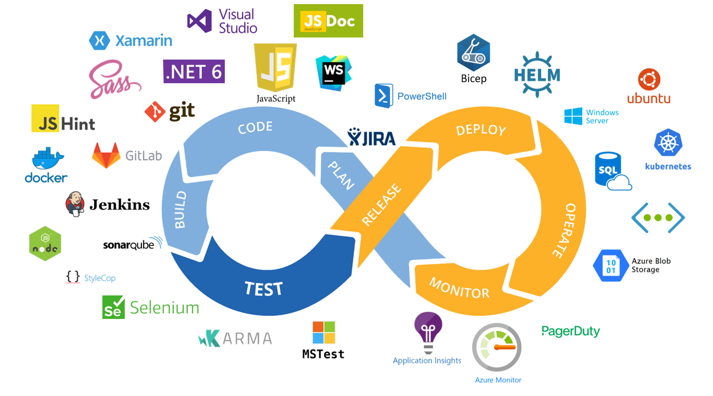

# Toolchain

At Ultimo we use many tools and services to build and host our application. Below an overview with the most important parts of our toolchain with a brief description.

| Component                  | Description |
| -------------------------- | ----------- |
| Jira                       | Backlog and sprint planning |
| Visual Studio              | C# development |
| Visual Studio Code         | Code editor for various languages |
| WebStorm                   | Javascript development |
| Git                        | Version control |
| GitLab                     | Merge requests & deployment |
| Docker                     | Building docker images |
| JS Hint                    | Static code analysis for javascript |
| Xamarin                    | Cross-platform mobile app development with .Net |
| Karma                      | Javascript test runner |
| Selenium                   | Automated browser based testing framework |
| MSTest                     | .Net test runner |
| NodeJS                     | Host for various build processes |
| SonarQube                  | Static code analysis for javascript & c# |
| StyleCop                   | Static code analysis for c# |
| Jenkins                    | Build & release |
| Bicep                      | Domain Specific Language for deploying Azure resources |
| Helm                       | Kubernetes deployment |
| Ubuntu                     | OS used in Linux containers |
| Windows                    | OS used in Windows containers |
| Kubernetes                 | Container orchestration |
| Azure SQL Elastic Pool     | Database host |
| Azure VNet                 | Networking |
| Azure Blob Storage         | Storage |
| Azure Monitor              | Monitor Azure resource health |
| Azure Application Insights | Monitor application and performance |
| PagerDuty                  | Automated incident response |

| Language                 | Description |
| ------------------------ | ----------- |
| .NET 6                   | Backend & deployment |
| Javascript               | Frontend |
| Powershell               | Deployment |
| Sass                     | CSS Stylesheet compiler |
| JS Doc                   | JS Documentation |
