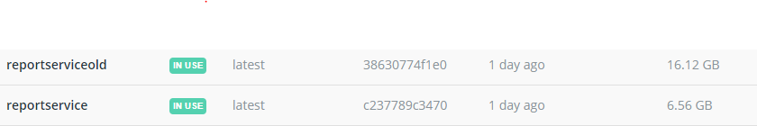
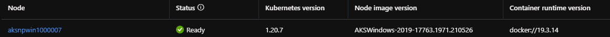

# Decrease Windows Container Size

We heavily rely on Windows containers on our Kubernetes cluster. Major downsides are the size and boot times of the pods running on Windows. We investigated how we could decrease the image size and boot times.

The container we are working on in this example is our reporting service. This service depends on Crystal Reports.

# Windows Container Flavours

You have to choose the correct base image that suits your needs. In the table below, I listed the main images to choose from. There are several others, but they are all build on top of these.

| Base image                   | Description   |
| ---------------------------- | ------ |
| microsoft/windows            | Full version of Windows, largest image. Use if you have dependencies  |
| microsoft/windowsserver      | Full version of Windows, slightly smaller then microsoft/windows |
| microsoft/windowsservercore  | Medium size version, full Windows without the unnecessary libraries |
| microsoft/nanoserver         | Very light version of Windows that is only usefull for new .Net Core/.Net 5 applications |

Except from the nanoserver image, all of the Windows images are quite large. But to be honest, I do not really see the point of this image. The nanoserver image can only be used if you have no dependencies to the Windows subsystem and cannot run .Net Framework applications. In this scenario you are probably better off using a Linux based image, that is even lighter and more stable.

Microsoft is investing a lot in optimizing Windows images. In recent articles from Microsoft (e.g. https://docs.microsoft.com/en-us/windows-server/get-started/whats-new-in-windows-server-2004-20h2) they have shown great improvements in decreasing the image sizes, especially for Server Core images. The size went down from ~11 GB to ~4 GB in the latest few versions.

| Base image                        | Size   |
| --------------------------------- | ------ |
| microsoft/windows:1809            | 14 GB  |
| microsoft/windowsservercore:1809  | 11 GB  |
| microsoft/windowsservercore:1903  | 5 GB  |
| microsoft/windowsservercore:1909  | 5 GB  |
| microsoft/windowsservercore:2004  | 4 GB  |

We where still running the full Windows images, so we wanted to benefit from this.

# Migrate to Server Core

The container we needed to migrate was depending on some legacy components. In this case we are running Crystal Reports. Crystal only was missing one dependency to OLE User Interface Support. This was resolved by copying the required dll's from the full Windows image.

The first attempt to work around the dependency issues was to copy the dll's from the full Windows image:
```
FROM mcr.microsoft.com/windows:1809 as fullWindows
FROM mcr.microsoft.com/dotnet/framework/runtime:4.8-windowsservercore-20H2

...

#Copy oledlg to servercore image
COPY --from=fullWindows /windows/system32/oledlg.dll /windows/system32/oledlg.dll
COPY --from=fullWindows /windows/syswow64/oledlg.dll /windows/syswow64/oledlg.dll

...
```

On my local machine this worked and decreased the image size with 9Gb! Very cool to see this kind of improvement, unfortunately we cannot use it but more about that later.


We need to run the container on Azure Kubernetes and the Windows nodes are running on version 2019. In the image below the version of Windows on the node VM is visible. The host OS doesn't support later versions of the guest OS to run, so we cannot benefit from the latest size reduction. More information on version compatibility can be found here: https://docs.microsoft.com/en-us/virtualization/windowscontainers/deploy-containers/version-compatibility?tabs=windows-server-20H2%2Cwindows-10-20H2


Making a direct comparison from the current Windows Image and Windows Server Core can still save 3Gb:
| Base image                        | Size   |
| --------------------------------- | ------ |
| microsoft/windows:1809            | 14 GB  |
| microsoft/windowsservercore:1809  | 11 GB  |


After changing to windowsservercore-ltsc2019, it works again on Kubernetes. We are now able to generate reports using Crystal Reports, but the fonts are broken. There is only 1 font available on Server Core. To solve this, we use the same trick. We copy all the fonts from the full Windows image to Server Core.

The final dockerfile that copies the missing dll's, fonts and registers the fonts. The entry point is now run.bat, that registers the fonts as soon as the container is booted:
```
FROM mcr.microsoft.com/windows:1809 as fullWindows

# Copy fonts and export registry. Exclude lucon.ttf, as it exists in image already
RUN powershell -NoProfile -Command "\
Copy-Item -Path C:\Windows\Fonts -Exclude lucon.ttf -Destination c:\Fonts -Recurse; \
New-Item -ItemType Directory -Force -Path c:\registries; \
reg export 'HKLM\SOFTWARE\Microsoft\Windows NT\CurrentVersion\Fonts' c:\registries\FontsReg.reg ; \
reg export 'HKLM\SOFTWARE\Microsoft\Windows NT\CurrentVersion\FontLink\SystemLink' c:\registries\FontLink.reg ; \
"

FROM mcr.microsoft.com/dotnet/framework/runtime:4.8-windowsservercore-ltsc2019

ADD vc_redist.x64.exe /vc_redist.x64.exe
RUN C:\vc_redist.x64.exe /quiet /install

# Copy fonts from above image
COPY --from=fullWindows /Fonts/ /Windows/Fonts/
COPY --from=fullWindows /registries/ ./registries/

#Copy oledlg to servercore image
COPY --from=fullWindows /windows/system32/oledlg.dll /windows/system32/oledlg.dll
COPY --from=fullWindows /windows/syswow64/oledlg.dll /windows/syswow64/oledlg.dll

ADD CRRuntime_64bit_13_0_14.msi /CRRuntime_64bit_13_0_14.msi
RUN msiexec.exe /i CRRuntime_64bit_13_0_14.msi /qn /L cr64.log

ADD crystal_isolation_level.reg /crystal_isolation_level.reg
RUN regedit -s crystal_isolation_level.reg

ADD sqlncli64.msi /sqlncli64.msi
RUN msiexec.exe /i sqlncli64.msi /qn IACCEPTSQLNCLILICENSETERMS=YES

WORKDIR /ServiceHost.ReportService/Reports
COPY Reports .

WORKDIR /ServiceHost.ReportService/Config
COPY Config .

WORKDIR /ServiceHost.ReportService/Bin
COPY Bin .
COPY run.bat ./
ENTRYPOINT ["cmd.exe", "/C run.bat"]

EXPOSE 6002/tcp
EXPOSE 6003/tcp
```

The content of run.bat:
```
reg import c:\registries\FontsReg.reg
reg import c:\registries\FontLink.reg

Ultimo.Services.ServiceHost.ReportService.exe /docker
```

We tried registring the fonts in the dockerfile itself, but for some reason this doesn't work in combindation with the used image versions. I do not understand why, please let me know if you have the answer to this!
